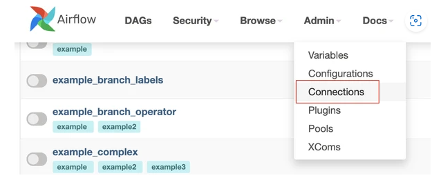
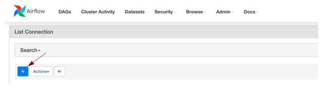
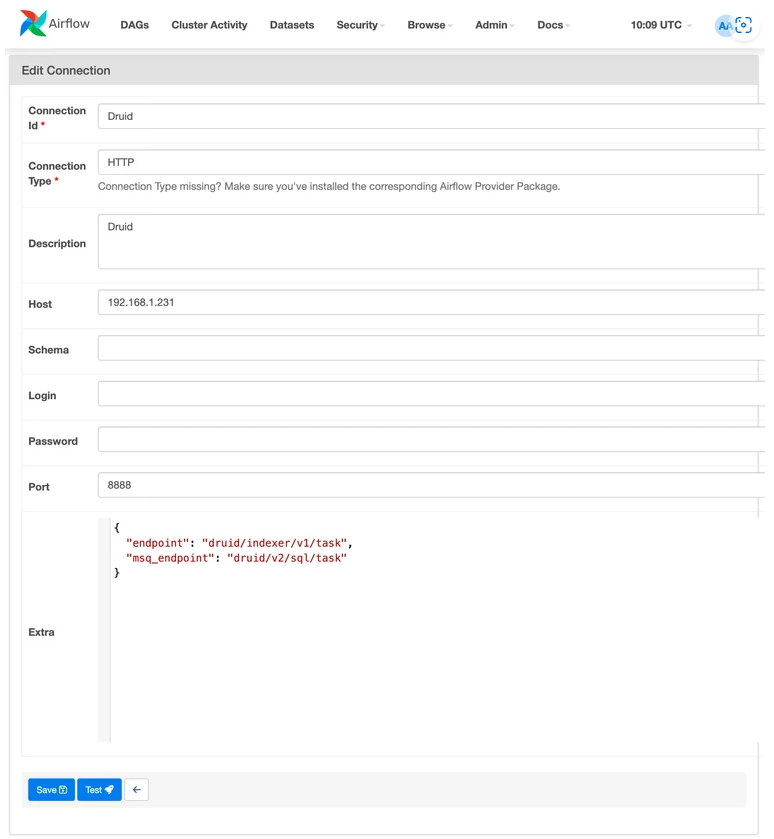

# 🚀 Using the Druid Operator in Airflow

This guide will show you how to use the **Druid Operator** in Apache Airflow to execute tasks related to Druid indexing and ingestion. 

## Prerequisites

To use DruidOperator, you must configure a Druid Connection first (Airflow host only)

```cmd
    pip install apache-airflow-providers-apache-druid
```

--- 

## Setting Up the Druid Connection

Navigate to the Connections section of Admin to add a connection



From here can click + add a new connection



Populate the dialog with the properties of your Druid cluster.



---

## Setting Up the Druid Operator

### Parameterizing an ingestion spec
Ideally only a few items in a batch ingestion spec should require parameterization for execution in Airflow. These may include entries such as directory prefixes, URIs or baseDirs, or the interval startTime / endTime. 

These parameters use Jinja templating, with parameters being specified in {{ }} and parameters including params. before their names like params.prefixes

Parameterizing our prefixes allows us to add code in our DAG to account for schemes which use subfolders to separate our source data.

Parameterizing our startTime and endTime allows us to add code in our DAG to manage ingestion timelines. We can daily, hourly, every 15 minutes – calculating start/end time is outside the scope of this doc.

**Note:**
Ingestion specs in this example are expected to be placed in the **plugins** directory.

You can also customize the ingestion specs path:

```python
    SPEC_PATH = os.path.abspath(os.path.join(os.path.dirname(__file__), '..'))

    with DAG(
    'druid-ingest-monitored',
    template_searchpath=[SPEC_PATH] ) as dag:
```

### Parameterized native ingestion spec

```json
    {
        "type": "index_parallel",
        "spec": {
            "ioConfig": {
            "type": "index_parallel",
            "inputSource": {
                "type": "http",
                "uris": [
                "{{ params.prefixes }}"
                ]
            },
            "inputFormat": {
                "type": "json"
            }
            },
            "dataSchema": {
            "granularitySpec": {
                "segmentGranularity": "day",
                "queryGranularity": "none",
                "rollup": false,
                "intervals": [
                "{{ params.startTime }}/{{ params.endTime }}"
                ]
            },
            "dataSource": "wikipedia",
            "timestampSpec": {
                "column": "timestamp",
                "format": "iso"
            },
            "dimensionsSpec": {
                "dimensions": [ ]
            }
            },
            "tuningConfig": {
            "type": "index_parallel",
            "partitionsSpec": {
                "type": "dynamic"
            }
            }
        }
        }
```

### Importing the Druid Operator

To use the Druid Operator, import it into your Airflow DAG definition file:

```python
from airflow.providers.druid.operators.druid import DruidOperator
```

### Defining a Simple DAG with DruidOperator
Here is a simple example of how to define a DAG using the DruidOperator to run a Druid indexing task:

```python
    from airflow.models import DAG
    from airflow.providers.apache.druid.operators.druid import DruidOperator
    from datetime import datetime, timedelta

    default_args = {
    'owner': 'Airflow',
    'depends_on_past': False,
    'email_on_failure': False,
    'email_on_retry': False,
    'retries': 1,
    'retry_delay': timedelta(minutes=1)
    }

    with DAG(
        dag_id = 'druidNativeIngestion',
        start_date = datetime(2021, 1, 1),
        max_active_runs = 1,
        schedule_interval = '@daily',
        default_args = default_args,
        catchup = False,
        template_searchpath = ['/opt/airflow/plugins/'], # Ingestion specs path
    ) as dag:
        druid_task = DruidOperator(
            task_id='run_druid_index_task',
            json_index_file='wikipedia_native.json',  # The Druid index task JSON file
            druid_ingest_conn_id='druid_broker_default',      # Connection ID for the Druid broker
            max_ingestion_time=300,                           # Maximum time for the ingestion task
            params=dict(
                prefixes = 'https://druid.apache.org/data/wikipedia.json.gz',
                startTime = '1999-01-1',
                endTime = '2024-12-31'
            )
        )

        druid_task

```

## 🔙 [Back to Homepage](README.md)